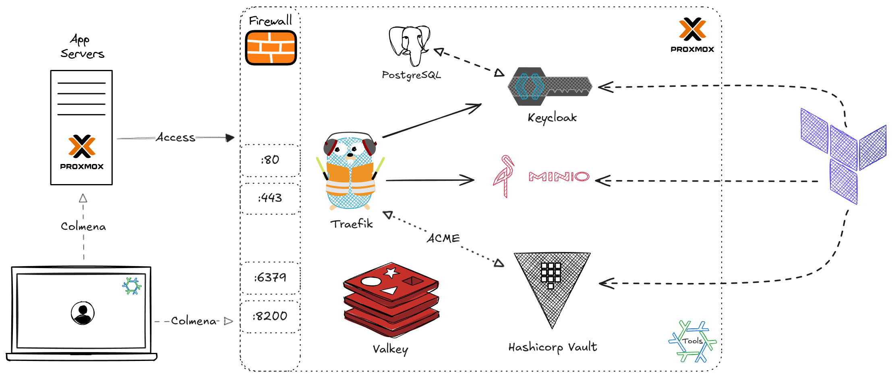

# Tools Server Configuration  

This repository contains all configurations for the **tools** server, managed declaratively with Nix and Terraform. It enables seamless provisioning, reproducibility, and security for server and application management.  

## Overview  

This setup follows an **Infrastructure as Code (IaC)** approach, ensuring:  
✅ **Reproducibility** – Easily spin up and restore servers with identical configurations.  
✅ **Security** – Secrets are encrypted and securely managed.  
✅ **Efficiency** – Use [colmena](https://colmena.cli.rs/) for deploying changes and potentially manage via CI/CD pipelines.

For a detailed walkthrough on how to build and manage servers declaratively, check out my [blog post](https://tech.aufomm.com/declarative-homelab-management-overview).  