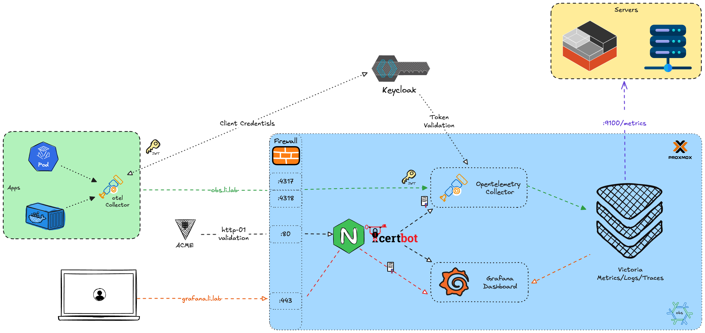

My homelab Observability stack

## Overview

I’ve always wanted to build a self-hosted observability stack for my homelab. The idea is to treat this server like a monitoring vendor which provides centralized entry point, while each of my servers has an agent running to ship telemetry data back to it. The goal is simple, the stack must be fully self-hosted, aligned with current observability best practices and trends, and flexible enough to switch backends if needed. Here is the architecture of my homelab observability stack:

### OpenTelemetry Collector

Thanks to the OpenTelemetry project, I can build a full observability pipeline using the OpenTelemetry Collector in two roles:

- Agent: running on each node to collect telemetry data, enrich them and send to the server.
- Server: Dedicated Server opening specific port to receive telemetry data from agents, enrich them and send to the storage backends.

I use OpenID Connect and Keycloak to secure communication between agents and the central collector.

Each agent collector authenticates using the **client_credentials** flow to request a token from Keycloak and forwards the token to the server. The server validates the token and attaches a specific claim value to the telemetry data attributes, allowing me to reliably filter the data coming from different agents/environments. 

### VictoriaMetrics

For this project, I chose VictoriaMetrics suite for [logs](https://github.com/VictoriaMetrics/VictoriaLogs), [metrics](https://github.com/VictoriaMetrics/VictoriaMetrics) and [traces](https://github.com/VictoriaMetrics/VictoriaTraces). 

Here are the main reasons
- Native NixOS modules are available, making deployment simple in my environment.
- The stack claim to be lightweight and designed for high performance especially compared to Prometheus, Loki and tempo.

I also use VictoriaMetrics to scrape nodes in my homelab that expose metrics via [node exporter](https://github.com/prometheus/node_exporter).

### ACME

For certificate management, I use [Hashicorp Vault](https://www.hashicorp.com/en/products/vault) to provide ACME service for my homelab. In this particular setup, I use nginx and certbot to automatically request and renew TLS certificates. Then the otel collector can use the certificate files to start and Grafana is hidden behind nginx.